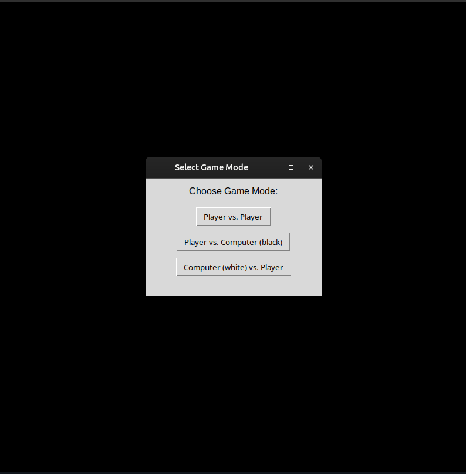
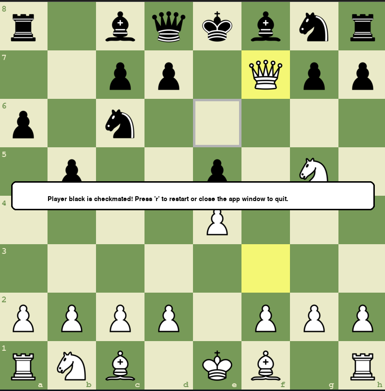
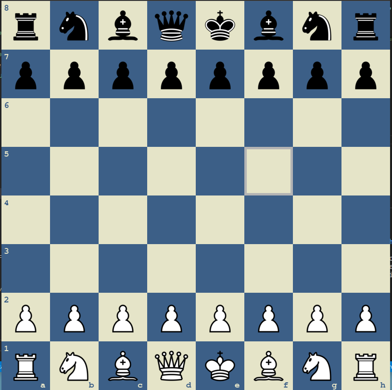

# Chess Game with AI

A fully-featured chess game implementation in Python with AI opponent using the minimax algorithm. This project includes a complete chess engine with move validation, game state management, and multiple play modes.

## Screenshots

### Game Start Menu


### Checkmate Detected


### Theme Switching



## Features

### Game Modes
- **Player vs Player (PvP)**: Two human players can play against each other
- **Player vs AI**: Human player (white) vs Computer (black)
- **AI vs Player**: Computer (white) vs Human player (black)

### Core Features
- Complete chess rule implementation including:
  - All piece movements (Pawn, Knight, Bishop, Rook, Queen, King)
  - Castling
  - En passant
  - Pawn promotion
  - Check and checkmate detection
  - Stalemate detection
- Move validation and legal move generation
- Visual move highlighting
- Drag and drop piece movement
- Move history tracking
- Undo functionality (press 'u')
- Sound effects for moves and captures

### AI Features
- Minimax algorithm with configurable depth
- Position evaluation based on piece values
- Move analysis with performance profiling
- Configurable AI difficulty through depth adjustment

### Visual Features
- Multiple color themes (press 't' to cycle)
- Coordinate display (ranks and files)
- Last move highlighting
- Possible move visualization
- Hover effects
- En passant pawn highlighting
- Game end popup messages

### Game Rules Implementation
- **Draw conditions**:
  - Stalemate
  - Insufficient material
  - 50-move rule
  - Three-fold repetition (partially implemented)
- **Win conditions**:
  - Checkmate detection
  - Resignation (AI can resign if no good moves found)

## Installation

### Prerequisites
- Python 3.7+
- pygame
- tkinter (usually included with Python)

### Setup
1. Clone the repository:
```bash
git clone <repository-url>
cd chess-game
```

2. Install required dependencies:
```bash
pip install pygame
```

3. Ensure you have the assets folder with:
   - `assets/images/imgs-80px/` - Piece images (80px)
   - `assets/images/imgs-128px/` - Piece images (128px)
   - `assets/sounds/` - Sound files (`move.wav`, `capture.wav`)

## Usage

### Starting the Game
```bash
python src/main.py
```

### Controls
- **Mouse**: Click and drag pieces to move
- **T**: Change color theme
- **R**: Restart game
- **U**: Undo last move
- **ESC/Close**: Quit game

### Game Mode Selection
When starting the game, a popup will appear asking you to choose:
1. Player vs Player
2. Player vs Computer (you play white)
3. Computer vs Player (you play black)

## Project Structure

```
src/
├── main.py          # Main game loop and event handling
├── game.py          # Core game logic and state management
├── board.py         # Board representation and move validation
├── piece.py         # Piece classes and piece logic
├── move.py          # Move representation
├── square.py        # Square representation
├── dragger.py       # Drag and drop functionality
├── minimax.py       # AI implementation using minimax
├── config.py        # Game configuration and themes
├── theme.py         # Theme system
├── color.py         # Color utilities
├── sound.py         # Sound management
└── const.py         # Game constants and enums
```

## Configuration

### AI Difficulty
Modify `AI_MAX_DEPTH` in `const.py` to adjust AI difficulty:
- `AI_MAX_DEPTH = 1`: Easy (very fast)
- `AI_MAX_DEPTH = 2`: Medium (default)
- `AI_MAX_DEPTH = 3`: Hard (slower)
- `AI_MAX_DEPTH = 4+`: Very hard (much slower)

### Board Size
Modify `WIDTH` and `HEIGHT` in `const.py` to change board size (default: 800x800).

### Themes
Add new themes in `config.py` by creating new `Theme` objects with different color schemes.

## Technical Details

### Board Representation
- Uses bitwise operations for efficient piece representation
- Maintains game state history for undo functionality
- Implements fast move generation and validation

### AI Implementation
- **Algorithm**: Minimax with alpha-beta pruning concepts
- **Evaluation**: Material-based scoring system
- **Performance**: Configurable depth with move analysis counting
- **Features**: Visual mode for debugging AI thinking process

### Move Validation
- Complete implementation of chess rules
- Efficient legal move generation
- Check detection and prevention of illegal moves
- Special moves (castling, en passant) fully supported

## Contributing

This project is based on original work by AlejoG10 with significant improvements and bug fixes by Krzysztof Kućmierz. Feel free to contribute by:

1. Reporting bugs
2. Suggesting new features
3. Improving AI algorithms
4. Adding new themes
5. Optimizing performance

## Known Limitations

- Three-fold repetition detection is partially implemented
- AI could benefit from more sophisticated position evaluation
- No chess notation export/import functionality
- Limited opening book knowledge
